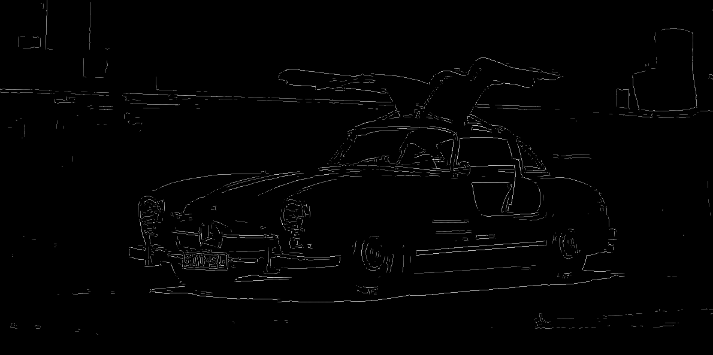

# ISP
ISP is an image simplification program.

## Features:
Canny edge detector, uses:
- 5x5 Gaussian kernel
- 3x3 Sobel kernel
- Lower bound cut-off suppression
- Double thresholding & 8-connectivity blob analysis
---
Color-based outline generation, uses:
- Gaussian Blur
- RGB to CIELAB color space conversion
- CIEDE2000 color difference formula

## Examples:
Applying Canny edge detection on a [Mercedes Benz 300SL](https://www.caranddriver.com/news/a27509956/1956-mercedes-benz-300sl-gullwing-auction/)

